# KevinCrrl

## Personal Website (Spanish)

[https://KevinCrrl.github.io/KevinCrrl/](https://KevinCrrl.github.io/KevinCrrl/)

------------------

## Recent Activity

<!--START_SECTION:activity-->
1. 🎉 Merged PR [#5025](https://github.com/BlackArch/blackarch/pull/5025) in [BlackArch/blackarch](https://github.com/BlackArch/blackarch)
2. 💪 Opened PR [#5025](https://github.com/BlackArch/blackarch/pull/5025) in [BlackArch/blackarch](https://github.com/BlackArch/blackarch)
3. ℹ️ Assigned issue [#11](https://github.com/KevinCrrl/evillimiter-ng/issues/11) in [KevinCrrl/evillimiter-ng](https://github.com/KevinCrrl/evillimiter-ng)
4. ℹ️ Labeled issue [#11](https://github.com/KevinCrrl/evillimiter-ng/issues/11) in [KevinCrrl/evillimiter-ng](https://github.com/KevinCrrl/evillimiter-ng)
5. ℹ️ Labeled issue [#11](https://github.com/KevinCrrl/evillimiter-ng/issues/11) in [KevinCrrl/evillimiter-ng](https://github.com/KevinCrrl/evillimiter-ng)
<!--END_SECTION:activity-->

## Activity by day

