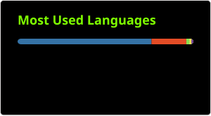

# KevinCrrl

## Personal Website (Mainly Spanish, some translations available in English)

[https://KevinCrrl.github.io/KevinCrrl/](https://KevinCrrl.github.io/KevinCrrl/)

---

## Recent Activity

<!--START_SECTION:activity-->

1. 🚀 Published release [V3.2.3](https://github.com/KevinCrrl/kpa/releases/tag/3.2.3) in [KevinCrrl/kpa](https://github.com/KevinCrrl/kpa)
2. 🚀 Published release [v3.0.3](https://github.com/KevinCrrl/evillimiter-ng/releases/tag/3.0.3) in [KevinCrrl/evillimiter-ng](https://github.com/KevinCrrl/evillimiter-ng)
3. 🎉 Merged PR [#5107](https://github.com/BlackArch/blackarch/pull/5107) in [BlackArch/blackarch](https://github.com/BlackArch/blackarch)
4. 🎉 Merged PR [#5106](https://github.com/BlackArch/blackarch/pull/5106) in [BlackArch/blackarch](https://github.com/BlackArch/blackarch)
5. 💪 Opened PR [#5107](https://github.com/BlackArch/blackarch/pull/5107) in [BlackArch/blackarch](https://github.com/BlackArch/blackarch)

<!--END_SECTION:activity-->

## Activity by day

# License

- My website includes a copy of [highlight.js](https://github.com/highlightjs/highlight.js), which is licensed under the BSD-3-Clause License. You can find a copy of its license in [this directory](static/js/highlight/LICENSE).

- All other scripts (`*.js`, `*.py`) in this repository written by me are licensed under the Apache-2.0 License.
